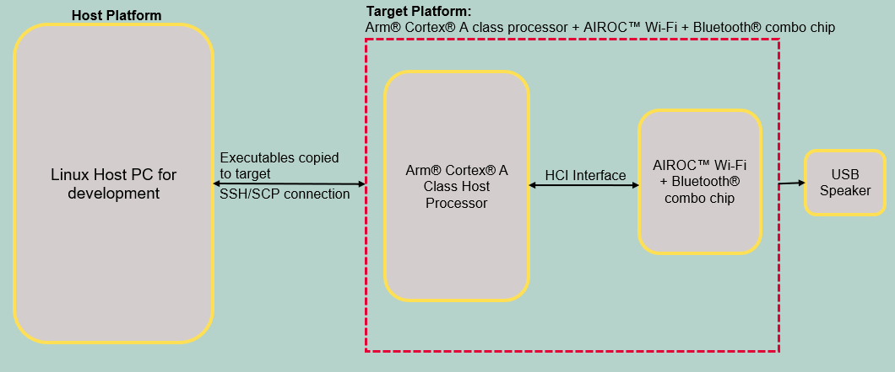
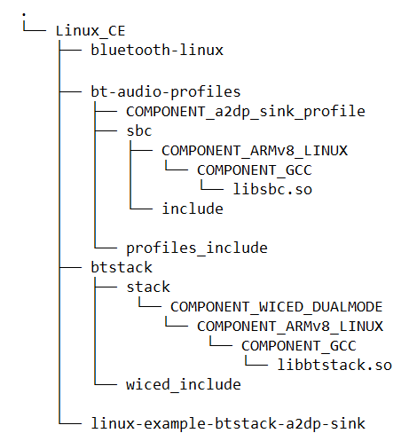
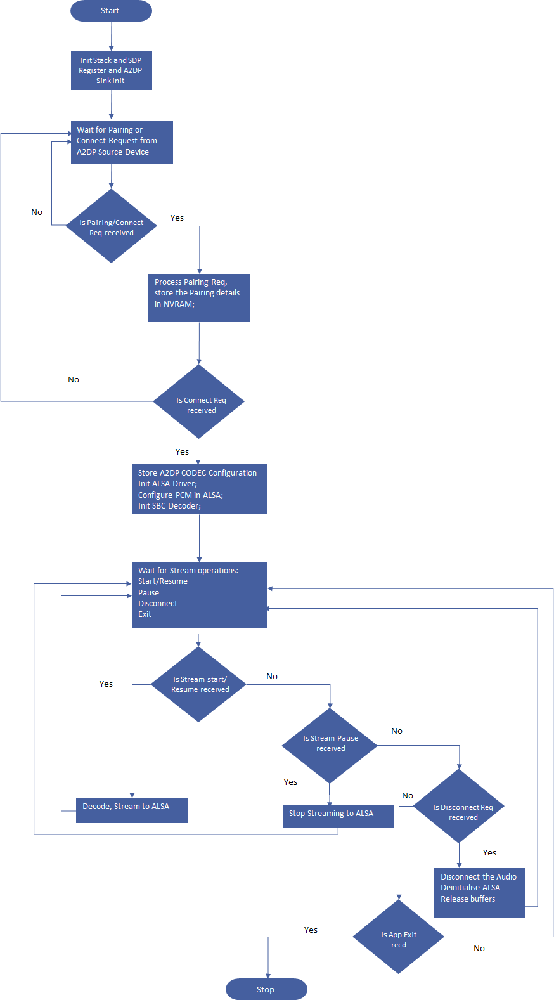

# AIROC™ BTSTACK: Bluetooth® A2DP Sink for Linux host

This application demonstrates an A2DP Sink using AIROC™ Wi-Fi & Bluetooth® combo chip. The application will appear as an audio sink device (IFX A2DP Sink), discoverable and connectable by default. When a remote A2DP source, such as a mobile device, is successfully bonded, the application saves the peer's Bluetooth&reg; device address to its bonded device list. Once the remote device connects the media channel, the audio streamed through any music application on the A2DP Source will be rendered on the A2DP Sink side.


[View this README on GitHub.](https://github.com/Infineon/linux-example-btstack-a2dp-sink)

[Provide feedback on this code example.](https://cypress.co1.qualtrics.com/jfe/form/SV_1NTns53sK2yiljn?Q_EED=eyJVbmlxdWUgRG9jIElkIjoiQ0UyMzY4OTUiLCJTcGVjIE51bWJlciI6IjAwMi0zNjg5NSIsIkRvYyBUaXRsZSI6IkFJUk9D4oSiIEJUU1RBQ0s6IEJsdWV0b290aMKuIEEyRFAgU2luayBmb3IgTGludXggaG9zdCIsInJpZCI6ImppYW5nIGRhIHlvdSIsIkRvYyB2ZXJzaW9uIjoiMS4wLjAiLCJEb2MgTGFuZ3VhZ2UiOiJFbmdsaXNoIiwiRG9jIERpdmlzaW9uIjoiTUNEIiwiRG9jIEJVIjoiSUNXIiwiRG9jIEZhbWlseSI6IkFJUk9DIn0=)

## Requirements

- Programming language: C
- Embedded Linux platforms (Arm® Cortex®-A Class processors) for host communications. Supported Embedded Linux host platforms:
   1. RPI CM4-lite IFX custom HW board from Infineon
   2. [IMX8 nano uCOM board](https://www.embeddedartists.com/products/imx8m-nano-developers-kit-v3/) from Embedded Artists
- AIROC™ BTSTACK library and Linux porting layer source code
- AIROC™ Wi-Fi & Bluetooth® Combo Chip Bluetooth® Firmware file (*.hcd*).
- Linux Host PC with Ubuntu 20.04


## Supported toolchains (make variable 'TOOLCHAIN')

- GNU Arm® GCC Arch64 v9.3.0 (`GCC_ARM`)

## Supported AIROC™ Wi-Fi & Bluetooth® Combo Chip

- [AIROC™ CYW5557x Wi-Fi & Bluetooth® Combo Chip](https://www.infineon.com/cms/en/product/wireless-connectivity/airoc-wi-fi-plus-bluetooth-combos/wi-fi-6-6e-802.11ax/)

## Hardware setup

Set up the hardware according to the following diagram:

**Figure 1. Block diagram: Hardware setup**



## Software setup

Set up a cross compiler according to the target platform along with CMake on the Linux host PC based on Ubuntu 20.04.

**Note:** These steps are for Arm&reg; 64-based target platform. Review these steps before adding support for any other target.

1. Open a terminal on the Linux host PC.

2. Use the following command to install the cross compiler, build tools, and dependencies:
   ```bash
   sudo apt-get install git cmake gcc-aarch64-linux-gnu build-essential -y
   ```

## Using the code example

Do the following on the Linux host PC to compile the code example:

1. Create a directory under `$HOME` on the Linux host PC and switch to the created directory. Refer to the following commands as an example:
   ```bash
   mkdir $HOME/Linux_CE
   cd $HOME/Linux_CE
   ```
   **Note:** Replace *Linux_CE* with a directory of your choice.

2. Fetch the code example source code using the following command.
   ```bash
   git clone https://github.com/Infineon/linux-example-btstack-a2dp-sink
   ```

3. Clone or prepare the code example dependencies (BTSTACK library, Linux porting layer, audio profiles source code, and Linux audio library) using the following commands.
   ```bash
   git clone https://github.com/Infineon/btstack --branch release-v3.6.0
   git clone https://github.com/Infineon/bluetooth-linux.git --branch release-v1.0.0
   git clone https://github.com/Infineon/bt-audio-profiles.git --branch release-v1.0.0
   ```

   Creates four different directories after cloning the code example and its dependencies with the directory structure as follows:

   **Figure 2. Code example directory structure**

   

4. Clone the Bluetooth® firmware using following command.
   ```bash
   git clone https://github.com/Infineon/combo-bluetooth-firmware.git
   ```
   User can choose appropriate Bluetooth® firmware for particular AIROC™ Wi-Fi & Bluetooth® Combo Chip from cloned "combo-bluetooth-firmware" directory.

5. Create the build folder under the code example source folder and build the code example using the following commands.
   ```
   cd $HOME/Linux_CE/linux-example-btstack-a2dp-sink
   mkdir build && cd build
   cmake -DCMAKE_C_COMPILER:PATH=<GCC_CROSS_COMPILER> ../ && make
   ```
   Where,
   - `GCC_CROSS_COMPILER` is the target cross compiler for GCC (generally */usr/bin/aarch64-linux-gnu-gcc* for ARM64-based targets)

   The code example executable is generated under the *build* folder with the same name.

   For example, in this project, the "linux-example-btstack-a2dp-sink" executable is generated at */home/$USER/Linux_CE/linux-example-btstack-a2dp-sink/build*.

## Features demonstrated
- A2DP connection
- A2DP audio streaming
- Audio pause and resume
- A2DP disconnection

## Operation

The code example acts as an A2DP Sink (rendering device for the audio being streamed from the A2DP source). The remote device will be the A2DP source that contains the media data such as the mobile phone. The application supports the Bluetooth&reg; standard SBC decoder.

### Devices used

- **Device Under Test (DUT):** Embedded Linux host platforms with AIROC™ Wi-Fi & Bluetooth® Combo Chip (target platform) that runs the A2DP sink application.

   Role: A2DP Sink

- **Testing device:** Bluetooth® A2DP Source such as mobile or laptop

   Role: A2DP Source

### Operation procedure

1. Copy the code example executable, AIROC™ BTSTACK library, audio profiles source code, Linux audio library, and Bluetooth® Firmware file from the Linux host PC to the target platform using [SCP](https://help.ubuntu.com/community/SSH/TransferFiles). For example, use the following commands:
   ```bash
   cd $HOME/Linux_CE/linux-example-btstack-a2dp-sink/build
   scp linux-example-btstack-a2dp-sink <TARGET_USER>@<TARGET_IP>:<TARGET_PATH>/.
   cd $HOME/Linux_CE/linuxbt/btstack/stack/COMPONENT_WICED_DUALMODE/COMPONENT_ARMv8_LINUX/COMPONENT_GCC
   scp libbtstack.so <TARGET_USER>@<TARGET_IP>:<TARGET_PATH>/.
   cd $HOME/Linux_CE/linuxbt/bt-audio-profiles/sbc/COMPONENT_ARMv8_LINUX/COMPONENT_GCC
   scp libsbc.so <TARGET_USER>@<TARGET_IP>:<TARGET_PATH>/.
   scp <FW_FILE.hcd> <TARGET_USER>@<TARGET_IP>:<TARGET_PATH>/.
   ```
   Where,
   - `TARGET_USER` is the user name of the target platform.
   - `TARGET_IP` is the IP address of the target platform.
   - `TARGET_PATH` is the path of the target platform.
   - `FW_FILE.hcd` file is Bluetooth® Firmware file cloned in step-4 of [Using the code example section](#using-the-code-example).

2. Take SSH console of target platform.
   ```bash
   ssh <TARGET_DEVICE_USER_NAME>@<TARGET_DEVICE_IP_ADDRESS>
   ```

3. Add the udev rule in the target board for HCI UART and GPIO to bypass root access. Use the following steps to create and set up a udev rule:

   **Note:** If you have root access, the following udev rules are not required; you can execute the code example with `sudo` permissions or by switching to the root user.

   1. Create a new *.rules* (for example, *combo-chip-uart-port.rules*) file under */etc/udev/rules.d/* directory for HCI UART. Use the following commands:

      **IMX8Nano:**

      ```bash
      echo "KERNEL==\"ttymxc0\"d,SYMLINK+=\"combo_chip_uart\",MODE=\"0666\"" | sudo tee /etc/udev/rules.d/combo-chip-uart-port.rules
      ```

      **RPICM4:**

      ```bash
      echo "KERNEL==\"ttyAMA0\",SYMLINK+=\"combo_chip_uart\",MODE=\"0666\"" | sudo tee /etc/udev/rules.d/combo-chip-uart-port.rules
      ```

   2. Create new *.rules* (for example, *combo-chip-gpio-port.rules*) for BT_REG_ON GPIO under */etc/udev/rules.d/*. Use the following commands:

      **IMX8Nano and RPICM4:**

      1. Create a rule file using the following command:

         ```bash
         sudo vim /etc/udev/rules.d/combo-chip-gpio-port.rules.rules
         ```

      2. Add the following rules in created files:

         ```bash
         SUBSYSTEM=="gpio*", PROGRAM="/bin/sh -c 'chown -R $user:$group /sys/class/gpio/export /sys/class/gpio/unexport;'"
         SUBSYSTEM=="gpio*", PROGRAM="/bin/sh -c 'chown -R $user:$group /sys%p/direction /sys%p/value; chmod 660 /sys%p/direction /sys%p/value;'"
         ```

   3. Reboot the target device:

      ```bash
      sudo reboot
      ```

      Where,

      - `ttymxc0` and `ttyAMA0` are HCI UART ports for IMX8Nano and RPICM4 respectively
      - `combo_chip_uart` is a friendly name for the HCI UART port
      - `0666` is the permission mask to bypass the root access for HCI UART

4. Set the default audio sink (USB speaker connected to target board) to the selected audio rendering device.
   ```bash
   pacmd set-default-sink <SINK_INDEX>
   ```
   Where,
   - `SINK_INDEX` is the index of connected audio sink device.  
   User can refer [these steps to learn how to set default sink device using pulseaudio](https://wiki.archlinux.org/title/PulseAudio/Examples#Set_the_default_output_sink)

5. Execute the application with setting the paths of the AIROC™ BTSTACK library using the following command on the target platform:
   ```bash
   cd <TARGET_PATH>
   chmod +x <APP_NAME>
   LD_LIBRARY_PATH=$LD_LIBRARY_PATH:<BTSTACK_LIB_PATH>
   ./<APP_NAME> -c <COM_PORT> -b 3000000 -f 921600 -r <GPIOCHIPx> <REGONPIN> -n -p <FW_FILE_NAME>.hcd -d 112233221137
   ```
   Where,
   - `APP_NAME` is the code example application executable
   - `TARGET_PATH` is the path of the target platform where the code example application copied to
   - `BTSTACK_LIB_PATH` is the path of the AIROC™ BTSTACK library. Skip this if the AIROC™ BTSTACK library and code example application executable are in the same folder
   - `/dev/ttymxc0` is the COM_PORT for IMX8Nano
   - `/dev/ttyAMA0` is the COM_PORT for RPICM4
   - `3000000` is the HCI baud rate
   - `112233221137` is a device BD address
   - `-r <GPIOCHIPx> <REGONPIN> -n`  is setting the GPIO control to enable autobaud for AIROC™ Wi-Fi & Bluetooth® combo chip
      - `-r gpiochip5 0 -n`  For IMX8Nano
      - `-r gpiochip0 3 -n`  For RPICM4
   - `921600` is the firmware download baud rate
   - *`.hcd`* is the firmware file to download (make sure to validate this firmware file file path)

   **Note:** Currently, random BD addresses are used for testing.

6. On the A2DP Source side, do the following:  
   a. Scan  
   b. Pair with "IFX A2DP Sink" (the A2DP Sink app on the board appears with this name when discovered)  
   c. Connect the media  
   d. Open a music streaming app and start streaming audio  
   e. Pause and resume when required  

7. When the user starts streaming audio, the music is heard on the headset/speaker connected to one of the USB ports on the target board at the A2DP Sink Application side.

8. When the user pauses/resumes audio on the phone music application, the audio stops and resumes at the sink side respectively.

9. If a disconnection occurs, the user is notified with the disconnection on the terminal.

10. The user can exit the application by typing '0' followed by <Enter> on the terminal.

## Debugging

User can debug the example using a generic Linux debugging mechanism such as the following:

- **Debugging by logging:** You can add prints in the application and check it during the execution.

- **Debugging using GDB:** See [GDB man page](https://linux.die.net/man/1/gdb) for more details.

## Design and implementation

This code example does the following:

1. Parses the command-line arguments.

2. Initializes the AIROC™ BTSTACK library for the AIROC™ Wi-Fi & Bluetooth® Combo Chip.

3. Registers the sink service with the stack.

   **Figure 3. a2dp sink process flowchart**

   

4. Waits till it is connected to an A2DP source device.

5. Initializes the platform audio driver and the SBC decoder.

6. Waits for the audio stream to start.

7. On receiving the audio data from source, the app calls the SBC decoder to decode audio packets and streams the PCM data to the Audio driver.

8. It continues beyond step 7 till it receives a Pause or Disconnect or Exit application.

**Note:** Run the application without any arguments to get details of command-line arguments.

## Source files

 Files   | Description of files
 ------- | ---------------------
 *app/main.c*  | Implements the main function which takes the user command-line inputs. Calls the *a2dp_sink.c* functions for all the A2DP Sink profile functionalities.
 *app/a2dp_sink.c*  | Implements all functionalities related to A2DP Sink.
 *app/bt_audio_linux_platform.c*  | Implements required functionalities related to interface with ALSA for Bluetooth&reg; audio handling.
 *app_bt_config/wiced_bt_cfg.c*  | This file is pre-generated using “Bluetooth&reg; configurator” on Windows. This file contains configurations related to Bluetooth&reg; settings, GAP, and A2DP sink.
 *app_bt_utils/app_bt_utils.c*  | Contains all the utility functions. For example, it contains functions to print error codes, status, etc. in a user-understandable format.
 *app_bt_utils/app_bt_utils.h*  | Header file corresponding to *app_bt_utils.c*
 *include/a2dp_sink.h*  | Header file corresponding to *a2dp_sink.c*.
 *include/bt_audio_linux_platform.h*  | Header file corresponding to *bt_audio_linux_platform.c*.
 *include/wiced.h*  | Header file applications macros.

### Resources and settings

**Table 1. Application resources**

 Resource  |  Alias/object     |    Purpose
 :-------- | :-------------    | :------------
 UART |HCI| UART is used for HCI communication with host system
 ALSA |ALSA| Software framework and part of the Linux kernel that provides an API for sound card device drivers. Required for rendering audio

**Table 2. Application Abbreviations**

 Abbreviations  |  Definition
 :-------- | :------------
 A2DP | Advanced Audio Distribution Profile
 SBC | Low Complexity Subband Coding
 PCM | Pulse code modulation
 HCI | Host controller interface
 UART | Universal asynchronous receiver-transmitter
 ALSA | Advanced Linux Sound Architecture

<br>

## Related resources

Resources  | Links
-----------|----------------------------------
Device documentation | [CYW5557x](https://www.infineon.com/cms/en/product/wireless-connectivity/airoc-wi-fi-plus-bluetooth-combos/cyw5557x/)
AIROC™ BTSTACK library | [AIROC™ BTSTACK library](https://github.com/Infineon/btstack/tree/release-v3.6.0)
Linux porting layer source code | [Linux porting layer source code](https://github.com/Infineon/bluetooth-linux/tree/release-v1.0.0)

## Other resources


Infineon provides a wealth of data at www.infineon.com to help you select the right device, and quickly and effectively integrate it into your design.

## Document history


Document title: *CE236895* – *AIROC™ BTSTACK: Bluetooth® A2DP Sink for Linux host*

 Version | Description of change
 ------- | ---------------------
 1.0.0   | New code example

<br>


© Cypress Semiconductor Corporation, 2023. This document is the property of Cypress Semiconductor Corporation, an Infineon Technologies company, and its affiliates ("Cypress").  This document, including any software or firmware included or referenced in this document ("Software"), is owned by Cypress under the intellectual property laws and treaties of the United States and other countries worldwide.  Cypress reserves all rights under such laws and treaties and does not, except as specifically stated in this paragraph, grant any license under its patents, copyrights, trademarks, or other intellectual property rights.  If the Software is not accompanied by a license agreement and you do not otherwise have a written agreement with Cypress governing the use of the Software, then Cypress hereby grants you a personal, non-exclusive, nontransferable license (without the right to sublicense) (1) under its copyright rights in the Software (a) for Software provided in source code form, to modify and reproduce the Software solely for use with Cypress hardware products, only internally within your organization, and (b) to distribute the Software in binary code form externally to end users (either directly or indirectly through resellers and distributors), solely for use on Cypress hardware product units, and (2) under those claims of Cypress’s patents that are infringed by the Software (as provided by Cypress, unmodified) to make, use, distribute, and import the Software solely for use with Cypress hardware products.  Any other use, reproduction, modification, translation, or compilation of the Software is prohibited.
<br>
TO THE EXTENT PERMITTED BY APPLICABLE LAW, CYPRESS MAKES NO WARRANTY OF ANY KIND, EXPRESS OR IMPLIED, WITH REGARD TO THIS DOCUMENT OR ANY SOFTWARE OR ACCOMPANYING HARDWARE, INCLUDING, BUT NOT LIMITED TO, THE IMPLIED WARRANTIES OF MERCHANTABILITY AND FITNESS FOR A PARTICULAR PURPOSE.  No computing device can be absolutely secure.  Therefore, despite security measures implemented in Cypress hardware or software products, Cypress shall have no liability arising out of any security breach, such as unauthorized access to or use of a Cypress product. CYPRESS DOES NOT REPRESENT, WARRANT, OR GUARANTEE THAT CYPRESS PRODUCTS, OR SYSTEMS CREATED USING CYPRESS PRODUCTS, WILL BE FREE FROM CORRUPTION, ATTACK, VIRUSES, INTERFERENCE, HACKING, DATA LOSS OR THEFT, OR OTHER SECURITY INTRUSION (collectively, "Security Breach").  Cypress disclaims any liability relating to any Security Breach, and you shall and hereby do release Cypress from any claim, damage, or other liability arising from any Security Breach.  In addition, the products described in these materials may contain design defects or errors known as errata which may cause the product to deviate from published specifications. To the extent permitted by applicable law, Cypress reserves the right to make changes to this document without further notice. Cypress does not assume any liability arising out of the application or use of any product or circuit described in this document. Any information provided in this document, including any sample design information or programming code, is provided only for reference purposes.  It is the responsibility of the user of this document to properly design, program, and test the functionality and safety of any application made of this information and any resulting product.  "High-Risk Device" means any device or system whose failure could cause personal injury, death, or property damage.  Examples of High-Risk Devices are weapons, nuclear installations, surgical implants, and other medical devices.  "Critical Component" means any component of a High-Risk Device whose failure to perform can be reasonably expected to cause, directly or indirectly, the failure of the High-Risk Device, or to affect its safety or effectiveness.  Cypress is not liable, in whole or in part, and you shall and hereby do release Cypress from any claim, damage, or other liability arising from any use of a Cypress product as a Critical Component in a High-Risk Device. You shall indemnify and hold Cypress, including its affiliates, and its directors, officers, employees, agents, distributors, and assigns harmless from and against all claims, costs, damages, and expenses, arising out of any claim, including claims for product liability, personal injury or death, or property damage arising from any use of a Cypress product as a Critical Component in a High-Risk Device. Cypress products are not intended or authorized for use as a Critical Component in any High-Risk Device except to the limited extent that (i) Cypress’s published data sheet for the product explicitly states Cypress has qualified the product for use in a specific High-Risk Device, or (ii) Cypress has given you advance written authorization to use the product as a Critical Component in the specific High-Risk Device and you have signed a separate indemnification agreement.
<br />
Cypress, the Cypress logo, and combinations thereof, WICED, ModusToolbox, PSoC, CapSense, EZ-USB, F-RAM, and Traveo are trademarks or registered trademarks of Cypress or a subsidiary of Cypress in the United States or in other countries. For a more complete list of Cypress trademarks, visit www.infineon.com. Other names and brands may be claimed as property of their respective owners.
